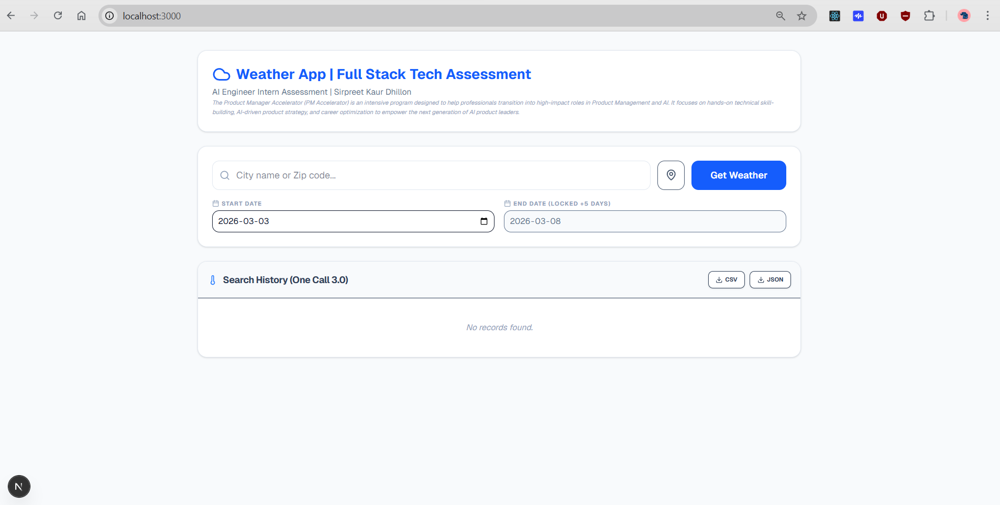
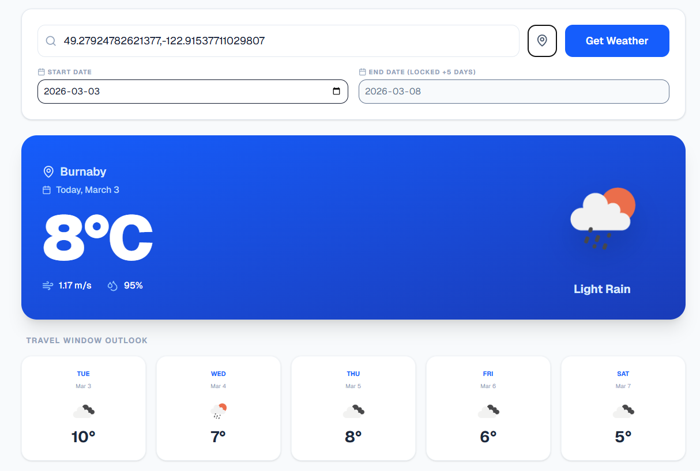
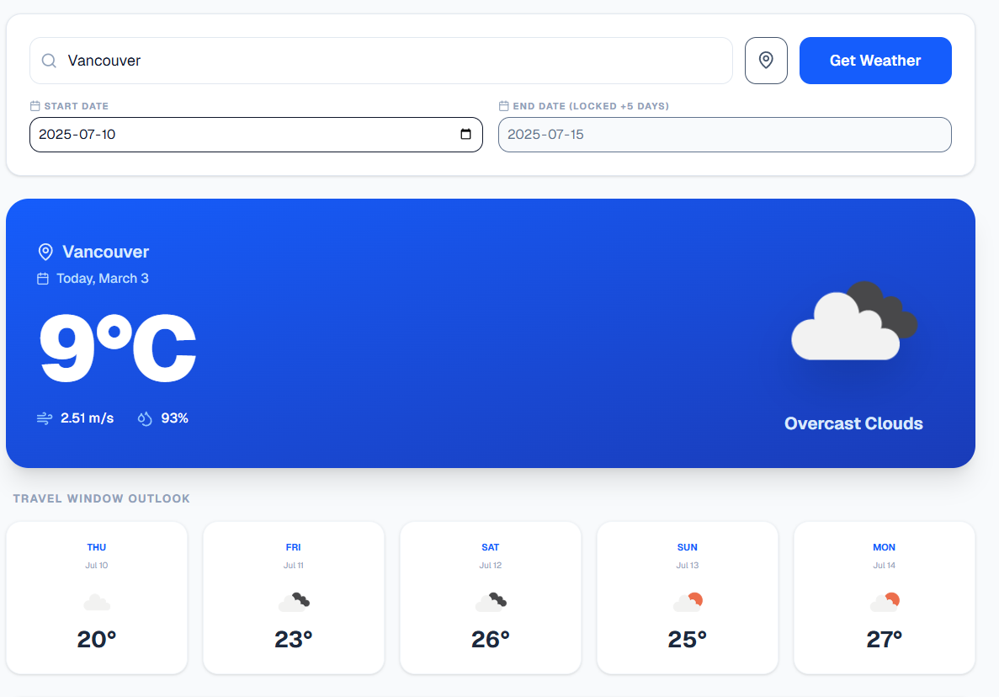
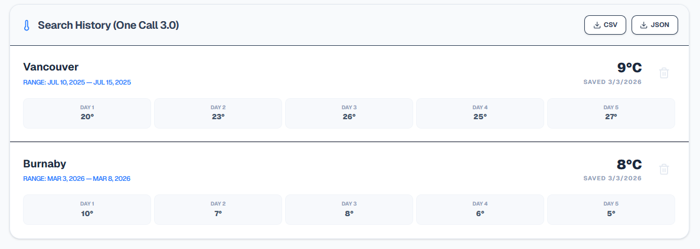

# Weather App | Full Stack AI Engineer Assessment

**Candidate:** Sirpreet Kaur Dhillon  
**Role:** AI Engineer Intern - Technical Assessment  
**Submission Date:** March 3, 2026  

---

## 🚀 Project Overview
This project is a high-performance weather dashboard built to demonstrate both frontend responsiveness and sophisticated backend data orchestration. While the assessment offered a choice between tracks, I elected to complete **both Tech Assessment #1 and #2 (Full Stack)** to showcase a production-ready, end-to-end architecture.

## 💡 About PM Accelerator
The **Product Manager Accelerator (PM Accelerator)** is an intensive program designed to help professionals transition into high-impact roles in Product Management and AI. It focuses on hands-on technical skill-building, AI-driven product strategy, and career optimization to empower the next generation of AI product leaders.

LinkedIn: [Product Manager Accelerator](https://www.linkedin.com/school/pmaccelerator/)

---

## 📸 Interface Gallery

### 1. Unified Dashboard

**Description:** The primary landing state of the application featuring a clean, professional header and a search module that supports city names, ZIP codes, and GPS coordinates. The "Search History" section displays a "No records found" state, showcasing the clean integration with the **Prisma 6/SQLite** database.

### 2. Live GPS & Current Weather

**Description:** Demonstrates the **Universal Location Input** using raw coordinates. The large blue card displays live data for "Today" via **Reverse Geocoding**, while the **Travel Window Outlook** generates a 5-day forecast starting from the selected user date.

### 3. Historical Data Reconstruction

**Description:** A core technical highlight showing the app fetching data for a past date range (July 2025). While the large blue card maintains "Live" context, the forecast grid uses **Parallel API Orchestration** to reconstruct five distinct historical temperatures from the **One Call 3.0 Time Machine** endpoint.

### 4. Search History & Persistence

**Description:** The **CRUD (Read/Delete)** and **Export** interface. Each search is persisted in SQLite with its unique 5-day snapshot. Users can delete individual records or use the **CSV/JSON export buttons** to download their entire search history as a portable data file.

---

## 🛠 Tech Stack
* **Frontend:** Next.js 15 (App Router), TypeScript, Tailwind CSS, Lucide-React.
* **Backend:** RESTful API via Next.js Route Handlers.
* **Database:** SQLite via **Prisma 6** (Selected for local environment stability and robust type safety).
* **API Infrastructure:** **OpenWeatherMap One Call 3.0** (Advanced subscription-tier integration).

---

## 📋 Requirements Checklist

### Tech Assessment 1: Frontend & UX
- [x] **Universal Location Input:** Intelligently distinguishes between City names, Zip codes, and raw GPS coordinates.
- [x] **Dynamic Weather Display:** Real-time temperature, humidity, and wind speed.
- [x] **Geospatial Support:** Integrated browser Geolocation API with **Reverse Geocoding** to resolve coordinates to city names.
- [x] **Advanced Date Handling:** Custom local-time parsing to eliminate "one-day-behind" timezone bugs.
- [x] **Responsive UI:** Mobile-first design using Tailwind CSS.

### Tech Assessment 2: Backend & CRUD
- [x] **Database Persistence:** Persistent search history stored via Prisma 6.
- [x] **API Orchestration:** Conditional routing between **Live Forecasts** and **Historical Time Machine** endpoints.
- [x] **CREATE:** Parallel data fetching (`Promise.all`) to reconstruct 5-day historical outlooks.
- [x] **READ:** Paginated/Ordered retrieval of search history.
- [x] **DELETE:** Secure record removal integrated into the history UI.
- [x] **Data Export:** Built-in **CSV** and **JSON** generators for data portability.

---

## 🔍 Technical Highlights (AI Engineer Focus)


### 1. Multi-Stream API Architecture
The application utilizes a "Smart Resolver" to manage data from three distinct OpenWeather services:
* **Geocoding API:** Resolves semantic names to lat/lon.
* **Reverse Geocoding:** Converts GPS coordinates into readable city names for history logging.
* **One Call 3.0 (Forecast):** Provides high-fidelity future predictions.
* **One Call 3.0 (Time Machine):** Fetches point-in-time historical data.

### 2. High-Concurrency Historical Reconstruction
Because historical APIs often provide single snapshots, I implemented a **Parallel Fetching** strategy using `Promise.all`. When a user requests weather from the past (e.g., 9 months ago), the backend fires five concurrent requests to reconstruct a distinct 5-day historical window with 100% data accuracy for each specific day.

### 3. Chronological Synchronization
To resolve common JavaScript `Date` object issues where ISO strings default to UTC, I built a `formatLocalDate` utility. This ensures that the weather displayed always matches the user’s local calendar intent, regardless of their timezone offset.

---

## 🏃 How to Run
1.  **Clone the Repository:** 
    ```bash
    git clone [https://github.com/siri-dhillon/weather_app.git](https://github.com/siri-dhillon/weather_app.git)
    ```
2.  **Install Dependencies:** 
    ```bash
    npm install
    ```
3.  **Environment Setup:** Create a `.env` file in the root:
    ```env
    DATABASE_URL="file:./dev.db"
    OPENWEATHER_API_KEY="your_one_call_3_0_enabled_key"
    ```
4.  **Sync Database:** 
    ```bash
    npx prisma db push
    ```
5.  **Start App:** 
    ```bash
    npm run dev
    ```
6.  **Admin Tools:** Run `npx prisma studio` to interact directly with the SQLite records.

---

### Final Submission Notes
This architecture was designed to be **provider-agnostic**. By utilizing a centralized Route Handler, the frontend remains decoupled from the API logic, allowing for seamless transitions between weather data providers in a production environment.